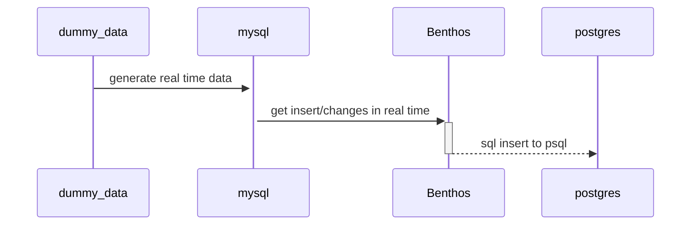

Simple sequence diagram about this poc:

> **Warning**  
> **IF THE DIAGRAM DIDN'T LOAD**: upgrade your browser or change it to another(Tested in Chrome and Firefox)

# About extrating method

`CDC` or `Change Data Capture`, is a method of capturing or extracting the data from a data source and pushing it to a `Data Lake` or `Data Warehouse` in real time or near real time. The idea is to capture the data after or while are being inserted in the data source, the idea is almost the same as incrementation method, when you get the last line or last data of a data source and insert it to the data lake/ data warehouse.

What stands for:

- CDC drives powerful data-driven use cases.
- CDC enables data to be transferred in real-time as changes happen.
- It's and improvement of the ETL.
    - Extract with CDC -> Real time or near real time
    - Transfom with CDC -> Transform the data while incrementing
    - Load with CDC -> Transform and Load occurs almost simultaneously.with CDC.
- The key principle of CDC is that it transfers data in tiny increments rather than bulk loads.

[Best Explanation for CDC](https://www.fivetran.com/blog/change-data-capture-what-it-is-and-how-to-use-it)

### Change data capture methods

- Log-based
    - In this method you can get the data from the data source log transation, this can be good for lower the resource usage from the database or make your data source have no load at all using a backup log transation to store the logs of this data source and use cdc to capture the data from this backup.
- Trigger-based
- Time-based
    - Get that data change based on a timestamped collum.
